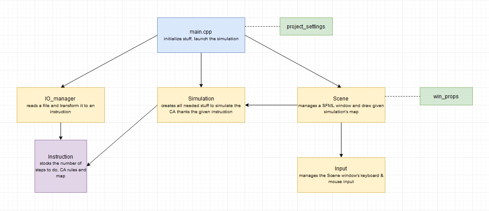

# MCAL project - Cellular automaton

## Run the program

Ensure you have correct rights to execute the shell script (`chmod 755 ./run.sh`).

```sh
./run.sh [-v] [-f] resourceFile
```

The shell script will compile and execute the code.

`-v` will make verbose while compiling / linking (useful when an error occurs).

`-f` will rebuild the project.

`resourceFile` is a text file (commonly in `resources/example/`).

For example :

```sh
./run.sh resources/example/5x5.txt
```

With console mode, you have to press Enter to step forward, and Ctrl+C to quit.

## Prerequires

Require | Needed
------- | -------
**Platform** | Linux (tested on Debian 10.5 and Ubuntu 20.04)
**C++ version** | C++17
**Library** | SFML >= 2.5


* Use a recent version of Bash if you use `run.sh` (otherwise, just do `make` and `./bin/debug/project`).
* To install the [SFML library](https://www.sfml-dev.org/) : `sudo apt-get install libsfml-dev`.

If you run it on WSL, make sure you have a X server, like [VcXsrv](https://sourceforge.net/projects/vcxsrv/), and run it.

SFML will display a warning message to tell you OpenGL's version is lower than requested, but it does not matter.


## Also

### The include/_conf/project_settings.h file

In this file, you can change some settings :

There's a graphic part. To disable it, set `USE_GRAPHICS` to `false`.

The scene can support multiple views, which are automatically organized depending of how many simulation is rendered. To check if views are correctly placed through the window, set the `CHECK_VIEWS` to `true`.

To activate the pseudo debug mode (which is verbosing in the console), set `DEBUG` to `true`.

You also can change the FPS.

**If you change something in this file, you must add the `-f` option for the run command.**


## Project's structure




## About

<small><i>Not completed yet...</i></small>


## License

See the [MIT License](https://github.com/NoxFly/MCAL-project/blob/master/LICENSE).
